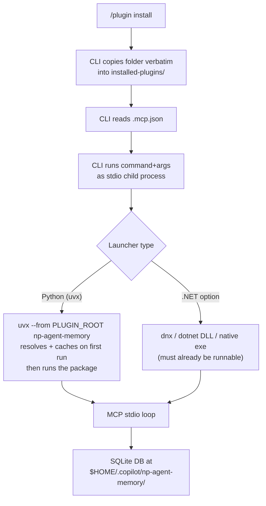

# Porting `NP.CoPilot.AgentMemory` to a .NET MCP Server — Requirements & Installation Model

**Research date:** 2026-06-12
**Repo analyzed:** [`NickPolyder/NP.CoPilot.AgentMemory`](https://github.com/NickPolyder/NP.CoPilot.AgentMemory) (v0.4.0)
**Question:** What would be required to convert this repository into a .NET MCP server, and how would installation work?

---

## Executive Summary

The repository is a Python 3.12+ MCP stdio server (`FastMCP`, 22–23 tools, SQLite + WAL, hand-rolled migrations and online backup) launched by the GitHub Copilot CLI via a `bootstrap.py` that builds a venv on first run. Porting it to .NET is **entirely feasible** — every building block has a mature, idiomatic .NET equivalent: the official **`ModelContextProtocol` C# SDK** (stable `1.4.0`, attribute + DI based, near 1:1 with FastMCP), **`Microsoft.Data.Sqlite`** (WAL, `BEGIN IMMEDIATE`/`DEFERRED`, online backup, busy/locked retry), **Cysharp `Ulid`**, and **`System.Text.Json`**. The real design decision is **not "can we port the code"** — it's **"how does the Copilot CLI launch a compiled .NET server"** given the CLI **copies the plugin folder verbatim with no build step**.[^1][^2]

There are three workable install models, in order of recommendation: **(1) `dnx` / `dotnet tool exec`** — the exact structural analogue of the current Python bootstrap (no binaries in git, downloads from NuGet on first run, requires **.NET 10 SDK**); **(2) committed framework-dependent publish output** launched via `dotnet ${PLUGIN_ROOT}/bin/.../Server.dll` (requires only the .NET runtime, but puts a binary in git); **(3) committed Native AOT exe** (~5–10 MB, zero runtime prerequisites, fastest cold start, but a heavier build toolchain and AOT caveats). The two approaches to **avoid** are `dotnet run` as the launch command (15–60 s first-run compile) and a "publish-on-first-launch" bootstrap (30–120 s) — both are far worse than the ~5 s Python venv build they'd replace.[^2]

**Confidence:** High on the porting mechanics and library choices (all backed by Microsoft Learn, NuGet, and the SDK source). Medium on a few CLI-specific launch behaviors that should be verified with a Phase-0-style spike (see Confidence Assessment).

---

## Part A — What the Current Python Server Actually Is (the port target)

A faithful port must reproduce all of this. Source: full architecture map of the repo.[^3][^4]

### Module layout
```
server/np_agent_memory/
├── __main__.py      # FastMCP instance, memory_alive tool, main()
├── db.py            # data-dir resolution, connect/open_connection, txn helpers, PRAGMAs
├── identity.py      # canonicalize_agent_cwd(), new_ulid(), now_iso()
├── startup.py       # init_db() — wires db + migrations
├── backup.py        # online backup + register_backup_tools()
├── migrations/      # __init__.py runner + 0001_init.sql (full schema)
└── tools/           # _common.py + agents/memory/todos/blockers/handovers/inbox
```

### The 22–23 MCP tools (7 domains)[^3]
| Domain | Tools |
|---|---|
| Server | `memory_alive`, `memory_backup_now` |
| Identity | `agent_register`, `agent_describe`, `agent_add_alias` |
| Memory | `memory_log`, `memory_query`, `memory_export` |
| Todos | `todo_add`, `todo_list`, `todo_update` |
| Blockers | `blocker_open`, `blocker_list`, `blocker_resolve` |
| Handovers (producer) | `handover_save`, `handover_latest`, `handover_export` |
| Handover ingest (two-phase) | `handover_claim`, `handover_ack`, `handover_release` |
| Inbox | `inbox_send`, `inbox_check`, `inbox_ack` |

All list tools share a pagination contract: `DEFAULT_LIMIT=50`, server-capped `MAX_LIMIT=200`, base64url-encoded JSON keyset cursors, body truncation unless `full=true`.[^3]

### Data + persistence behaviors that must be preserved[^3]
- **9 tables**: `agents`, `agent_aliases`, `notes`, `todos`, `blockers`, `inbox`, `handovers`, `backup_runs`, `migrations`. ULID text PKs; ISO-8601 UTC text timestamps; `CHECK`/`UNIQUE` constraints; `json_valid()` metadata columns; ~15 named indexes.
- **Connection**: per-call, autocommit (`isolation_level=None`), `sqlite3.Row` factory. PRAGMAs on every connection: `busy_timeout=5000`, `journal_mode=WAL` (verified, raises `WalConversionError` if not WAL), `foreign_keys=ON`, `synchronous=NORMAL`.
- **Transactions**: `run_in_write_txn` = `BEGIN IMMEDIATE`; `run_in_read_txn` = `BEGIN DEFERRED`. Retry on codes `{5,6,261,262,517}`, up to 6 attempts, exponential backoff + jitter.
- **Migrations**: numbered `NNNN_name.sql`, SHA-256 checksum tracking, SQLite **authorizer** that DENYs transaction-control opcodes, applied inside a runner-owned `BEGIN IMMEDIATE` (autocommit connection), busy-retry with backoff.
- **Backup**: SQLite online backup API to a `<name>.<uuid>.tmp` file then atomic `os.replace`; daily throttle via a `BEGIN IMMEDIATE` check on `backup_runs`; 14-day pruning; lazy daemon thread at startup.
- **Identity**: `agent_cwd` canonicalization (resolve symlinks → `normcase` → forward slashes → strip trailing slash). The CLI does **not** advertise MCP `roots`, so every agent-scoped tool takes an explicit `agent_cwd` string.[^4][^5]

### Dependencies / runtime
`mcp==1.26.0`, `python-ulid==3.1.0`; `requires-python>=3.12`. Uses 3.12-only features (`sqlite3.connect(autocommit=True)`, PEP 695 generics).[^3]

---

## Part B — How the Current Plugin Installs & Launches (the constraint to satisfy)

This is the crux. A .NET replacement must live inside the **same launch contract**.

### `.mcp.json` (target form — `uvx`)[^4]
```json
{
  "mcpServers": {
    "np-agent-memory": {
      "type": "local",
      "command": "uvx",
      "args": ["--from", "${PLUGIN_ROOT}", "np-agent-memory"],
      "env": { "PYTHONUNBUFFERED": "1" }
    }
  }
}
```
> The project is migrating its launch command to **`uvx --from ${PLUGIN_ROOT} np-agent-memory`** (in progress on a separate session). `uvx` fetches + runs the package from the local source without a persistent global install — the venv/resolve cost is paid on first run and cached after. The prior form was `py -3 ${PLUGIN_ROOT}/bootstrap.py` (a stdlib bootstrap that built a venv in the runtime dir). **This `uvx` model is exactly why `dnx` is the natural .NET target: `uvx → dnx` is a 1:1 structural mapping** (see Part D.1).

### The install contract (verified in `docs/spike-0.md`)[^4]
1. **Copy-verbatim, no build hook.** `/plugin install` copies the entire source folder (gitignore not honored) into `$HOME\.copilot\installed-plugins\<marketplace>\<plugin>\`. There is **no opportunity to compile** at install time.
2. **`${PLUGIN_ROOT}` substitution** works in `command`, `args`, and `env` values.
3. **Inherited stdio.** Whatever `.mcp.json` launches *is* (or directly execs) the MCP server; stdio pipes must pass through untouched.
4. **Runtime data lives outside the install dir** at `$HOME\.copilot\np-agent-memory\` (override `AGENT_MEMORY_DIR`), so it survives `plugin update`. The Python bootstrap builds its venv there too.
5. **Silent failure mode.** If the server fails to start, the agent just sees "tool not found" — all diagnostics must go to **stderr**, which the CLI captures to `~/.copilot/logs/process-*.log`.
6. **One server process per CLI window** → concurrent processes hit the same DB file (hence WAL + busy retry).
7. **Plugin manifest** lives in `.claude-plugin/plugin.json` + `.claude-plugin/marketplace.json`; tools are namespaced `np-agent-memory-<tool>`.

**Why `uvx` (and the prior bootstrap) work:** the dependency resolve / venv build of two small wheels happens once on first launch (a few seconds), then every subsequent launch is instant from cache. **A .NET port must find an equivalent that doesn't reintroduce a multi-second compile on every cold start** — which points straight at `dnx`.



---

## Part C — The .NET Building Blocks (1:1 port mapping)

### C.1 MCP server framework — `ModelContextProtocol` C# SDK[^6]
- Repo [`modelcontextprotocol/csharp-sdk`](https://github.com/modelcontextprotocol/csharp-sdk), Apache-2.0. **Latest stable `1.4.0`** (June 2026); `2.0.0-preview.1` in-flight. Implements MCP spec `2025-11-25` including tools, prompts, resources, **roots**, sampling, elicitation.
- Packages: `ModelContextProtocol.Core` (low-level), **`ModelContextProtocol`** (stdio + DI/hosting — the right choice), `ModelContextProtocol.AspNetCore` (HTTP/SSE).
- Targets `net8.0`/`net9.0`/`net10.0` (+ `netstandard2.0`). **`net8.0` is fine** for a stdio server. Native AOT supported.
- Tool model maps cleanly to FastMCP: `[McpServerToolType]` on a class, `[McpServerTool, Description(...)]` on methods, `[Description]` on params → auto JSON Schema. DI services and special params (`McpServer`, `CancellationToken`, `IProgress<>`) are injected into tool methods.

**Minimal stdio server** (the whole framing the Python `__main__.py` provides):[^6]
```csharp
using Microsoft.Extensions.DependencyInjection;
using Microsoft.Extensions.Hosting;
using Microsoft.Extensions.Logging;
using ModelContextProtocol.Server;
using System.ComponentModel;

var builder = Host.CreateApplicationBuilder(args);

// CRITICAL: all logging to stderr — anything on stdout corrupts JSON-RPC framing
builder.Logging.AddConsole(o => o.LogToStandardErrorThreshold = LogLevel.Trace);

builder.Services.AddSingleton<AgentMemoryDb>();   // shared DB service via DI
builder.Services
    .AddMcpServer()
    .WithStdioServerTransport()
    .WithToolsFromAssembly();   // or .WithTools<MemoryTools>() per domain

await builder.Build().RunAsync();

[McpServerToolType]
public sealed class MemoryTools
{
    [McpServerTool, Description("Append a note to the agent's memory timeline.")]
    public static MemoryLogResult MemoryLog(
        AgentMemoryDb db,                                   // injected
        [Description("Your repository root.")] string agentCwd,
        [Description("progress | decision | note")] string category,
        string content) => db.LogNote(agentCwd, category, content);
}
```
The same **stderr-only logging** rule the Python server relies on applies here.[^6]

### C.2 SQLite data layer — `Microsoft.Data.Sqlite`[^7]
Near 1:1 with Python `sqlite3`:

| Python today | .NET equivalent |
|---|---|
| `PRAGMA busy_timeout/journal_mode/...` | Same PRAGMAs executed after `Open()` (no connection-string keyword for busy_timeout) |
| `BEGIN IMMEDIATE` | `conn.BeginTransaction(deferred: false)` (also the default) |
| `BEGIN DEFERRED` | `conn.BeginTransaction(deferred: true)` (v5.0+) |
| retry on `{5,6,...}` | catch `SqliteException` where `SqliteErrorCode` ∈ {5,6} + extended {261,262,517}; backoff loop |
| `src.backup(dest)` | `source.BackupDatabase(dest)` (wraps SQLite online backup API) |
| atomic `os.replace` | `File.Move(tmp, final, overwrite: true)` |

```csharp
static SqliteConnection OpenWal(string dbPath, int busyMs = 5000)
{
    var conn = new SqliteConnection(new SqliteConnectionStringBuilder {
        DataSource = dbPath, Mode = SqliteOpenMode.ReadWriteCreate, Pooling = true
    }.ToString());
    conn.Open();
    foreach (var p in new[] {
        "PRAGMA journal_mode = WAL", $"PRAGMA busy_timeout = {busyMs}",
        "PRAGMA synchronous = NORMAL", "PRAGMA foreign_keys = ON" })
    { using var c = conn.CreateCommand(); c.CommandText = p; c.ExecuteNonQuery(); }
    return conn;
}
```

**Caveats to plan for:**[^7]
- **No `sqlite3_set_authorizer` exposed** (issue dotnet/efcore#13835). The migration authorizer guard that DENYs transaction-control opcodes can't be reproduced directly — replace it with a convention (scripts in a restricted embedded namespace) or raw `SQLitePCLRaw` P/Invoke.
- `BackupDatabase` **blocks writers** during the copy (fine for a small daily snapshot).
- `*Async` methods are synchronous under the hood; `SqliteConnection` is not thread-safe (already matches the per-call connection pattern).
- Native `e_sqlite3.dll` ships via `SQLitePCLRaw.bundle_e_sqlite3`; it extracts beside the exe in single-file/AOT publishes.

### C.3 Migrations[^7]
| Approach | Fit |
|---|---|
| **Hand-rolled `.sql` runner** | ✅ Closest parity with the current runner; reuse `0001_init.sql` almost verbatim; SHA-256 tracking trivial. |
| **DbUp-SQLite** (6.0.4) | ✅ Same "ordered SQL scripts + `SchemaVersions` table" philosophy, embedded resources, transaction-per-script. |
| FluentMigrator | ⚠️ Code-first C# DSL; good if you want rollbacks, but requires rewriting `.sql` into C#. |
| EF Core migrations | ❌ Overkill; ~5 MB + model + startup scan. |

**Recommendation: hand-rolled runner or DbUp-SQLite**, embedding the existing `.sql` files via `<EmbeddedResource Include="Migrations/**/*.sql" />`.

### C.4 Smaller equivalents[^8]
| Concern | Python | .NET recommendation |
|---|---|---|
| ULID | `python-ulid` | **Cysharp `Ulid`** — `Ulid.NewUlid().ToString()` → identical 26-char Crockford base32 |
| JSON | `json` | **`System.Text.Json`** (SDK-mandated, source-gen + AOT-safe) |
| ISO-8601 UTC | `datetime.now(UTC).isoformat()` → `+00:00` | `DateTimeOffset.UtcNow.ToString("O")` → `Z` (⚠️ format differs; use `"yyyy-MM-ddTHH:mm:ss.ffffffK"` if exact cross-language string parity with existing rows matters) |
| base64url cursors | `base64.urlsafe_b64encode` | `System.Buffers.Text.Base64Url` (.NET 9+) or `WebEncoders.Base64UrlEncode` (net8) |
| SHA-256 checksums | `hashlib.sha256` | `System.Security.Cryptography.SHA256` |
| Tests | pytest | **xUnit v3** + temp-file/in-memory SQLite |
| Object mapping (optional) | rows | **Dapper** over raw ADO.NET (keep manual txn control) |

> ⚠️ **Timestamp parity caveat:** Python emits 6-digit microseconds + `+00:00`; .NET `"O"` emits 7-digit + `Z`. SQLite string comparisons still sort correctly, but if you reuse an existing DB, pick a single fixed format constant so old and new rows compare identically.[^8]

### Suggested .NET project structure (mirrors the Python package)
```
src/Np.AgentMemory.McpServer/
├── Program.cs                 # Host builder + AddMcpServer().WithStdioServerTransport()
├── Db/AgentMemoryDb.cs        # OpenWal, RunInWriteTxn/RunInReadTxn, retry
├── Db/Backup.cs               # BackupDatabase + daily throttle + prune
├── Migrations/Runner.cs + 0001_init.sql (embedded)
├── Identity/AgentCwd.cs       # canonicalization
└── Tools/AgentTools.cs, MemoryTools.cs, TodoTools.cs, ...  # [McpServerToolType] per domain
tests/Np.AgentMemory.Tests/    # xUnit
.mcp/server.json               # registry metadata (if publishing to NuGet)
```

---

## Part D — Installation: How a .NET MCP Server Gets Launched

This is where .NET diverges most from Python, because there is **no build step at install time**. Seven options were evaluated against the copy-verbatim-then-launch contract.[^2][^9]

### Comparison
| Option | Runtime prereq | Artifact in git | Cold start (1st / Nth) | Fits copy+launch? | Notes |
|---|---|---|---|---|---|
| **`dnx` / `dotnet tool exec`** | **.NET 10 SDK** | none | 5–30 s / ~200 ms | ✅ | Direct analogue of `uvx`/bootstrap; downloads NuGet tool on demand, caches |
| FDD DLLs committed | .NET runtime (matching TFM) | ~15–25 MB | ~200 ms / ~200 ms | ✅ | `dotnet ${PLUGIN_ROOT}/bin/publish/Server.dll`; binary in git; per-platform native sqlite |
| Self-contained exe | none | ~20–80 MB | ~200 ms | ✅ (win-only) | One exe per platform; large git footprint |
| Single-file exe | none / runtime | ~12–20 MB | ~300 ms / ~100 ms | ✅ (win-only) | Use `AppContext.BaseDirectory`, not `Assembly.Location` |
| **Native AOT exe** | **none** | ~5–10 MB | **~50 ms** | ✅ | Fastest, smallest, zero prereq; needs C++ toolchain to build; AOT caveats |
| .NET tool (`-g` install) | .NET SDK + prior install | none | fast post-install | ❌ | Two-step; copy alone doesn't install it |
| `dotnet run` as command | .NET SDK | source only | **15–60 s** / 1–4 s | ⚠️ | Compiles on launch — too slow; may write into read-only plugin dir |
| Bootstrap "publish on first run" | .NET SDK | source only | **30–120 s** / ~200 ms | ⚠️ | 10–25× slower than the Python venv bootstrap — bad UX |

### D.1 Recommended primary: `dnx` (NuGet `McpServer` tool)
This is the cleanest structural match to the `uvx` launch model (`uvx → dnx`) and the **Microsoft-official distribution path**.[^9]

**`.csproj` that packs the server as an MCP-server dotnet tool:**[^9]
```xml
<PropertyGroup>
  <TargetFramework>net10.0</TargetFramework>
  <OutputType>Exe</OutputType>
  <PackAsTool>true</PackAsTool>
  <PackageType>McpServer</PackageType>      <!-- .NET 10; use "DotnetTool;McpServer" on .NET 8/9 -->
  <ToolCommandName>np-agent-memory</ToolCommandName>
  <PackageId>NickPolyder.NpAgentMemory</PackageId>
  <PackageVersion>0.4.0</PackageVersion>
</PropertyGroup>
<ItemGroup>
  <None Include=".mcp\server.json" Pack="true" PackagePath="/.mcp/" />
  <PackageReference Include="ModelContextProtocol" Version="1.4.0" />
  <PackageReference Include="Microsoft.Extensions.Hosting" />
</ItemGroup>
```

**`.mcp/server.json`** (read by NuGet.org + MCP registry):[^9]
```json
{
  "$schema": "https://static.modelcontextprotocol.io/schemas/2025-10-17/server.schema.json",
  "name": "io.github.nickpolyder/np-agent-memory",
  "description": "Shared agent memory + inbox + handover transport.",
  "version": "0.4.0",
  "packages": [{
    "registryType": "nuget",
    "identifier": "NickPolyder.NpAgentMemory",
    "version": "0.4.0",
    "runtimeHint": "dnx",
    "transport": { "type": "stdio" }
  }],
  "repository": { "url": "https://github.com/NickPolyder/NP.CoPilot.AgentMemory", "source": "github" }
}
```

**Resulting `.mcp.json` in the Copilot plugin** (`dnx` replaces `uvx`):[^9]
```json
{
  "mcpServers": {
    "np-agent-memory": {
      "type": "local",
      "command": "dnx",
      "args": ["NickPolyder.NpAgentMemory@0.4.0", "--yes"],
      "env": { "AGENT_MEMORY_DIR": "" }
    }
  }
}
```
- `dnx` (= `dotnet tool exec`, new in **.NET 10.0.100 SDK**) downloads the package to the NuGet cache on first run, then runs instantly thereafter — exactly mirroring `uvx`'s resolve-once-then-cache model.[^2][^9]
- **`--yes` is required**: `dnx` prompts for confirmation before downloading a new package unless `--yes` is passed. (Note: one source claimed child-process context auto-suppresses the prompt; the Microsoft docs example explicitly passes `--yes`, so include it.)[^9]
- **Hard requirement: .NET 10 SDK** on the user's machine. If only .NET 8/9 SDK or just the runtime is present, `dnx` is unavailable → use the fallback.

### D.2 Recommended fallback (broad compatibility): committed FDD publish
If you can't assume .NET 10 SDK, commit `dotnet publish -c Release` output and launch the portable DLL:[^2]
```json
{ "command": "dotnet", "args": ["${PLUGIN_ROOT}/bin/publish/NpAgentMemory.dll"] }
```
- Requires only the **.NET runtime** (not the SDK). Fast cold start.
- Trade-off: a binary lives in git (poor delta compression; keep it small/trimmed; enforce "re-publish on source change" via CI). Per-platform native `e_sqlite3.dll` if you need non-Windows.

### D.3 Zero-prerequisite option: committed Native AOT exe
For the absolute best cold start and **no .NET install at all**, commit a ~5–10 MB AOT binary:[^2]
```json
{ "command": "${PLUGIN_ROOT}/bin/native/win-x64/NpAgentMemory.exe", "args": [] }
```
- ~50 ms startup; git-friendly size. Costs: needs the C++ Desktop workload to build, must use `System.Text.Json` source-gen (no reflection-based serialization), and `Microsoft.Data.Sqlite` AOT needs `Batteries_V2.Init()` + the native lib beside the exe. **EF Core + AOT is still experimental** — another reason to stick with raw `Microsoft.Data.Sqlite`.[^7]

### D.4 What to avoid
- **`dotnet run` as the launch command** — 15–60 s first-run compile makes the plugin look broken, and it may try to write `bin/` into a read-only plugin dir.[^2]
- **Publish-on-first-launch bootstrap** — `dotnet publish` is 30–120 s; 10–25× worse than the Python venv it replaces.[^2]

---

## Part E — Migration Effort & Things That Get Easier / Harder

### Easier in .NET
- Single self-contained/AOT artifact → **no venv, no `bootstrap.py`, no pip** at runtime (if you go the committed-binary route).
- Faster cold start and lower memory; richer typed tool returns; first-class DI.
- Strong typing across the whole tool/DB surface.

### Harder / needs attention
| Item | Why |
|---|---|
| **Install story** | The single biggest design decision (Part D). The Python `uvx` "resolve-and-cache on first launch" model has a direct .NET equivalent only in `dnx` (SDK-gated); otherwise you ship a binary. |
| **Migration authorizer** | `sqlite3_set_authorizer` not exposed by `Microsoft.Data.Sqlite`; reproduce via convention or P/Invoke. |
| **Timestamp string format** | `Z` vs `+00:00`, 7 vs 6 fractional digits — pin a format constant if reusing existing DB rows. |
| **AOT constraints** | If choosing AOT: source-gen JSON only, `Batteries_V2.Init()`, native sqlite side-by-side, no EF Core. |
| **Cross-platform binaries** | Committing per-RID exes is impractical except AOT (~30 MB for 4 platforms). `dnx`/NuGet sidesteps this. |
| **Test port** | Rewrite ~13 pytest modules in xUnit; mechanical but non-trivial. |

### Suggested phased approach (mirrors the repo's own ADR/spike discipline)
1. **Spike 0 (.NET):** prove the launch model end-to-end. Build a 1-tool C# stdio server, package as a `dnx` tool *and* a committed FDD DLL, register both via `.mcp.json`, and confirm the Copilot CLI launches each, that `${PLUGIN_ROOT}` substitutes, stdio is clean, and `dnx --yes` doesn't prompt. Decide the install model **before** porting logic. Write `docs/decisions/000X-dotnet-port-launch-model.md`.
2. **Schema + DB layer:** reuse `0001_init.sql`; implement `AgentMemoryDb` (WAL, immediate/deferred, retry), migration runner, backup.
3. **Tools, domain by domain**, with xUnit tests at each step.
4. **Identity + pagination + truncation** parity.
5. **Manifest + install scripts** (`.claude-plugin/*`, `install.ps1` → `dotnet pack`/`nuget push` or publish-and-commit).

---

## Key Repositories & References

| Resource | Use |
|---|---|
| [`modelcontextprotocol/csharp-sdk`](https://github.com/modelcontextprotocol/csharp-sdk) | The MCP C# SDK (`ModelContextProtocol` 1.4.0) |
| [Microsoft Learn — Build an MCP server in C#](https://learn.microsoft.com/en-us/dotnet/ai/quickstarts/build-mcp-server) | Official pack-as-tool + `dnx` flow |
| [`dotnet/aspnetcore` McpServer templates](https://github.com/dotnet/aspnetcore) | `dotnet new mcpserver` template (`.csproj.in`, `server.json`) |
| [`sbroenne/mcp-server-excel`](https://github.com/sbroenne/mcp-server-excel) | Real-world .NET 8 `PackageType=DotnetTool;McpServer` workaround |
| [`Clinical-Support-Systems/blitz-bridge`](https://github.com/Clinical-Support-Systems/blitz-bridge) | Real-world `server.json` with `runtimeHint: dnx` |
| [Microsoft.Data.Sqlite docs](https://learn.microsoft.com/en-us/dotnet/standard/data/sqlite/) | WAL, transactions, backup, errors |
| [.NET 10 SDK — `dnx` / `dotnet tool exec`](https://learn.microsoft.com/en-us/dotnet/core/whats-new/dotnet-10/sdk) | The `uvx`-equivalent launcher |
| [Cysharp `Ulid`](https://github.com/Cysharp/Ulid) | ULID generation |

---

## Confidence Assessment

**High confidence (documented & cross-checked):**
- Current Python architecture, schema, tools, and install/launch contract — from a full repo map and the `docs/spike-0.md` / `docs/spike-roots.md` findings.[^3][^4][^5]
- The MCP C# SDK exists, is stable at `1.4.0`, and maps 1:1 to FastMCP semantics.[^6]
- `Microsoft.Data.Sqlite` supports every DB behavior the port needs (WAL, immediate/deferred, online backup, busy retry), with the authorizer gap as the one exception.[^7]
- `dnx`/`dotnet tool exec` is the Microsoft-blessed launch mechanism and the structural twin of the current bootstrap.[^9]

**Medium confidence / verify with a spike:**
- **`dnx --yes` behavior under MCP stdio:** sources disagree on whether the confirmation prompt auto-suppresses in a piped child process. Passing `--yes` is the safe, documented form, but confirm the CLI doesn't hang on first run.[^2][^9]
- **`${PLUGIN_ROOT}` + other substitutions:** confirmed for `${PLUGIN_ROOT}` in args; unknown whether `%LOCALAPPDATA%`/`$HOME` are substituted (matters only if you redirect `dotnet run --artifacts-path`, which we recommend against anyway).[^2]
- **Copilot CLI start-timeout:** the threshold at which a slow-starting server is marked failed is unknown — relevant to first-run `dnx` download time. Verify in the spike.[^2]
- **Binary sizes** (5–10 MB AOT, 20–35 MB trimmed SC) are representative estimates, not measured for this codebase.[^2]

**Assumptions made:**
- Windows-primary, single-developer tool (matches the repo's conventions) — so a Windows-only committed binary or an SDK-gated `dnx` path is acceptable.
- ".NET MCP server" means a faithful functional port of the existing 22-tool surface, not a redesign.

---

## Footnotes

[^1]: [.mcp.json](https://github.com/NickPolyder/NP.CoPilot.AgentMemory/blob/main/.mcp.json) — launch config. Target form (migration in progress): `uvx --from ${PLUGIN_ROOT} np-agent-memory`; prior form: `py -3 ${PLUGIN_ROOT}/bootstrap.py`. Per maintainer (@NickPolyder, 2026-06-12): "the subagent was correct. I am converting to uvx on another session."
[^2]: .NET deployment-model research — Microsoft Learn deployment docs (`/dotnet/core/deploying/`, `/native-aot/`, `/single-file/`), `dotnet-run`, `dotnet-tool-exec`, and the .NET 10 SDK "what's new" page. See "Citations" table in source notes; key URLs: https://learn.microsoft.com/en-us/dotnet/core/tools/dotnet-tool-exec , https://learn.microsoft.com/en-us/dotnet/core/whats-new/dotnet-10/sdk , https://learn.microsoft.com/en-us/dotnet/core/deploying/native-aot/
[^3]: Repository architecture map — `server/np_agent_memory/` modules, `__main__.py:41-167`, `db.py:32-265`, `migrations/__init__.py`, `backup.py:40-225`, `migrations/0001_init.sql`, `tools/_common.py:20-21`. [server/np_agent_memory](https://github.com/NickPolyder/NP.CoPilot.AgentMemory/tree/main/server/np_agent_memory)
[^4]: Install/launch documentation — `.mcp.json`, `bootstrap.py:35-275`, `install.ps1`, `.claude-plugin/plugin.json`, `.claude-plugin/marketplace.json`, `docs/spike-0.md`. [bootstrap.py](https://github.com/NickPolyder/NP.CoPilot.AgentMemory/blob/main/bootstrap.py)
[^5]: `docs/spike-roots.md` — Copilot CLI (`github-copilot-developer`, protocol 2025-11-25) does NOT advertise MCP `roots`; `list_roots` → "Method not found"; hence required `agent_cwd`. `identity.py:32-107`.
[^6]: MCP C# SDK research — [`modelcontextprotocol/csharp-sdk`](https://github.com/modelcontextprotocol/csharp-sdk) (`src/Directory.Build.props`, `samples/QuickstartWeatherServer/`), NuGet `ModelContextProtocol` 1.4.0, https://csharp.sdk.modelcontextprotocol.io/concepts/getting-started.html , https://learn.microsoft.com/en-us/dotnet/ai/quickstarts/build-mcp-server
[^7]: `Microsoft.Data.Sqlite` research — https://learn.microsoft.com/en-us/dotnet/standard/data/sqlite/ (connection-strings, transactions, database-errors, backup, compare); SQLitePCLRaw https://github.com/ericsink/SQLitePCL.raw ; authorizer gap dotnet/efcore#13835; backup-blocking dotnet/efcore#13834; DbUp https://dbup.readthedocs.io/ .
[^8]: Port-library research — Cysharp [`Ulid`](https://github.com/Cysharp/Ulid) 1.4.1; `System.Text.Json`; `DateTimeOffset.ToString("O")` vs `isoformat()`; `System.Buffers.Text.Base64Url` (.NET 9+) / `WebEncoders` (net8); `System.Security.Cryptography.SHA256`; xUnit v3.
[^9]: .NET MCP distribution research — Microsoft Learn quickstart `learn.microsoft.com/en-us/dotnet/ai/quickstarts/build-mcp-server`; `dotnet/aspnetcore:src/ProjectTemplates/McpServer.ProjectTemplates/`; `sbroenne/mcp-server-excel` `.csproj`; `Clinical-Support-Systems/blitz-bridge` `.mcp/server.json` (`runtimeHint: dnx`); `dnx` docs `learn.microsoft.com/en-us/dotnet/core/whats-new/dotnet-10/sdk`.
